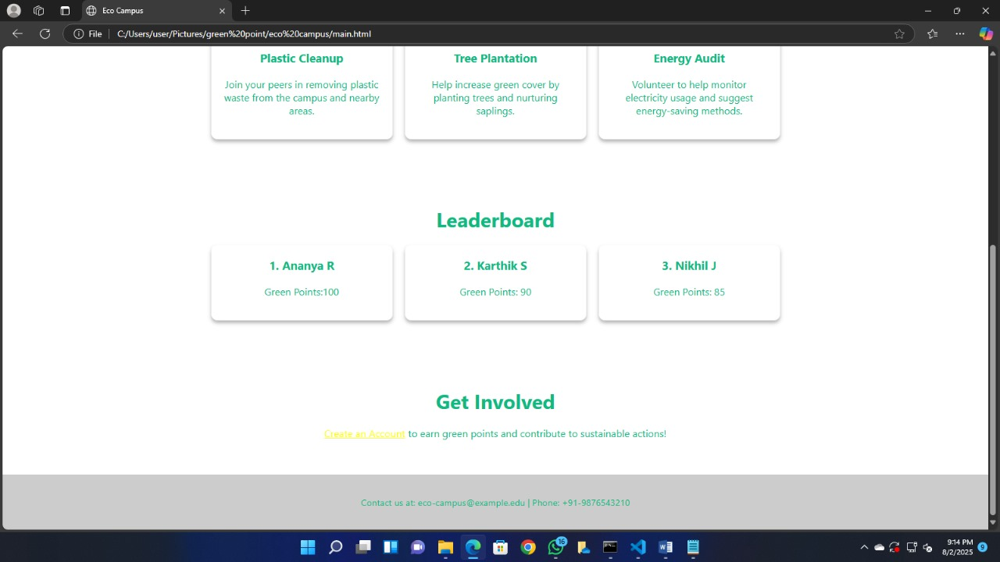

# 🚀 Green Spark Submission

## Project Title
Green Point System for a 
Sustainable Campus 

## Problem Statement Addressed
College campuses often struggle to engage students in sustainability efforts, with no effective system to motivate, track, or reward eco-friendly actions. How can technology be used to create an engaging, transparent, and rewarding platform that encourages consistent student participation in building a greener campus?

## Project Overview
The Green Point System is a tech-enabled, year-round program designed to make sustainability fun and rewarding on campus. Students earn points for participating in eco-friendly activities—such as waste collection, awareness campaigns, and green events—which are verified by campus volunteers. Achievements are recognized with digital badges and prizes, fostering friendly competition and long-term positive habits. The system will feature a mobile or web app for real-time activity logging, transparent leaderboards, and easy participation. The ultimate goal is to build a community of environmentally responsible students and create a cleaner, greener campus.

## Key Features
1.Activity-Based Points System
Students earn points by completing verified eco-friendly activities such as waste collection, poster campaigns, awareness speeches, and participation in green events.

2.Volunteer Verification
Campus volunteers oversee and approve each activity to ensure authenticity and fairness.

3.Digital Badges & Rewards
Students reaching a points threshold receive digital Green Badges, while top performers earn special eco-friendly prizes, fostering recognition and motivation.

4.Leaderboard and Progress Tracking
A real-time leaderboard motivates students through friendly competition and showcases top contributors across different academic years.

5.Mobile/Web Application
The platform enables easy logging of activities, submission of proof, volunteer approvals, and real-time tracking for both students and administrators.

6.Scalable & Transparent
The system is designed for easy expansion to other campuses and ensures transparency in participation, verification, and rewards.

7.Promotes Long-Term Engagement
By making sustainability efforts rewarding and visible, the system encourages consistent participation and fosters lifelong eco-conscious habits.

## GitHub Repository Link
https://github.com/theCluelessOne/Green-Campus

## Team Members & Roles
Aadesh A Kumar -  Team Leader, backend
Saurav B - Idea generation, frontend
Akshay S - UI/UX design
Adarsh Raj M - frontend

## Screenshot

## Possible Challenges

User Engagement: Motivating students to consistently participate in sustainability activities.

Activity Verification: Ensuring fairness and transparency in task validation.

Seamless User Experience: Designing an intuitive interface for diverse users.

Scalability: Building a system that can grow and adapt for larger communities.

Real-time Tracking: Implementing live leaderboards and progress updates.

## Tech stack

Backend: Django (Python)

Frontend: HTML, CSS, JavaScript

Database: PostgreSQL (or SQLite for initial phases)

Authentication: Django’s built-in user authentication

## Future Plans

Launch a fully functional web application with real-time leaderboards and digital badge distribution.

Develop a mobile app for easier activity tracking and notifications.

Integrate QR code scanning for quick task verification.

Expand the system to other colleges or community organizations.

